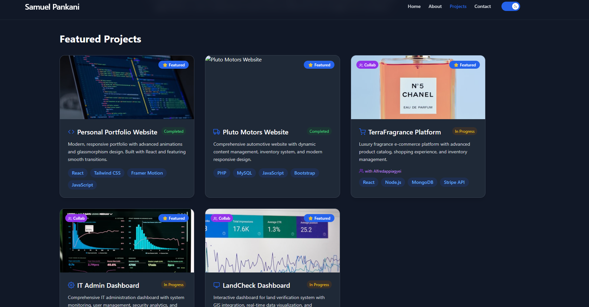

# Samuel Pankani - Professional Portfolio

  
_Modern, responsive portfolio showcasing skills and projects_

## Overview

A cutting-edge portfolio website demonstrating my expertise as a full-stack developer and tech professional. This responsive application highlights my technical capabilities through interactive elements, clean design, and comprehensive project showcases.

## Key Features

- **Responsive UI**: Fully adaptive layout for all device sizes
- **Interactive Elements**: Framer Motion-powered animations and transitions
- **Project Management**: Dynamic filtering by project type (Web, Full Stack, Collaborations)
- **Professional Timeline**: Visual representation of education and career progression
- **Theme Support**: Dark/light mode toggle
- **Optimized Performance**: Built with Vite for fast loading
- **SEO Ready**: Structured for search engine visibility

## Technology Stack

**Frontend**  


**Build Tools**  


## Project Structure

```bash
portfolio/
├── public/            # Static assets
│   ├── favicon.png
│   ├── manifest.json
│   └── offline.html
├── src/
│   ├── assets/        # Images and SVGs
│   ├── components/    # Reusable components
│   │   ├── Footer.jsx
│   │   ├── Navbar.jsx
│   │   └── Spinner.jsx
│   ├── pages/         # Route components
│   │   ├── About.jsx
│   │   ├── Contact.jsx
│   │   ├── Home.jsx
│   │   ├── Portfolio.jsx
│   │   └── Projects.jsx
│   ├── App.css        # Global styles
│   ├── App.jsx        # Root component
│   ├── main.jsx       # Application entry
│   └── theme.jsx      # Theme configuration
├── package.json       # Project configuration
└── vite.config.js     # Build configuration
```

## Getting Started

### Prerequisites

- Node.js (v16+ recommended)
- npm (v8+ recommended)

### Installation

1. Clone the repository:

   ```bash
   git clone https://github.com/Pankani1/Portfolio_React.git
   cd Portfolio_React
   ```

2. Install dependencies:

   ```bash
   npm install
   ```

3. Start development server:

   ```bash
   npm run dev
   ```

4. Open your browser to:
   ```
   http://localhost:5173
   ```

### Building for Production

```bash
npm run build
npm run serve
```

## Live Demo

Explore the deployed version:  
[pankani-portfolio.netlify.app](https://pankani-portfolio.netlify.app)

## Contact Information

- **Email**: [spankani6@gmail.com](mailto:spankani6@gmail.com)
- **GitHub**: [Pankani1](https://github.com/Pankani1)
- **LinkedIn**: [Samuel Pankani](https://linkedin.com/in/samuel-pankani)
- **Phone**: +233 54 127 2232

## License

This project is licensed under the MIT License - see the [LICENSE](LICENSE) file for details.

---

_Last updated: July 21, 2025_  
_Created with passion by Samuel Pankani_
